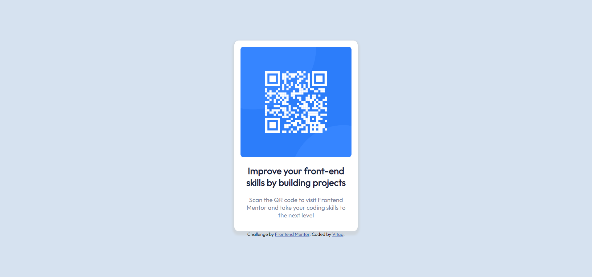

# Frontend Mentor - QR code component solution

This is a solution to the [QR code component challenge on Frontend Mentor](https://www.frontendmentor.io/challenges/qr-code-component-iux_sIO_H). Frontend Mentor challenges help you improve your coding skills by building realistic projects.

## Table of contents

- [Frontend Mentor - QR code component solution](#frontend-mentor---qr-code-component-solution)
  - [Table of contents](#table-of-contents)
  - [Overview](#overview)
    - [Screenshot](#screenshot)
    - [Link](#link)
  - [My process](#my-process)
    - [Built with](#built-with)
    - [What I learned](#what-i-learned)
    - [Continued development](#continued-development)
  - [Author](#author)

## Overview

### Screenshot

<figure align="center">
  
  <figcaption>
    <b>Fig.1 - Desktop Screenshot</b>
  </figcaption>
</figure>

<figure align="center">
  
  <figcaption>
    <b>Fig.2 - Mobile Screenshot</b>
  </figcaption>
</figure>

### Link

- Solution URL: [my solution](https://www.frontendmentor.io/solutions/qr-code-component-jQcLSgLtKa)
- Live Site URL: [qr-code-component-main](https://qr-code-component-main-taupe.vercel.app/)

## My process

### Built with

- Semantic HTML5 markup
- CSS custom properties
- Sass
- Flexbox

### What I learned

- How to apply google fonts

```html
<link rel="stylesheet" href="https://fonts.googleapis.com/css?family=Outfit" />
```

```css
body {
  font-family: "Outfit", serif;
}
```

- BoxShadow

```css
main {
  box-shadow: 0 5px 5px 5px $gray;
}
```

### Continued development

- Learn more about responsive web design

## Author

- Github - [Vitap](https://github.com/Vitap7)
- Frontend Mentor - [@Vitap7](https://www.frontendmentor.io/profile/Vitap7)
